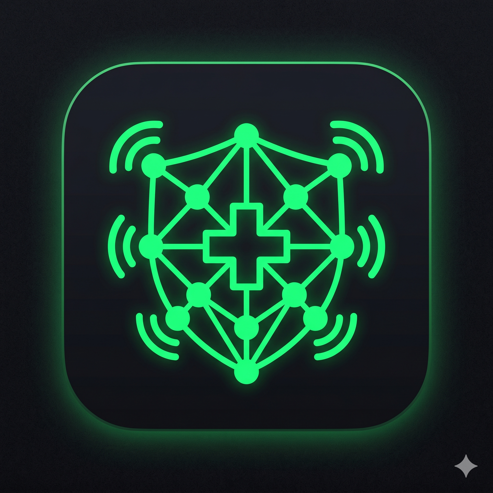

# 🌋 CrisisResilience (Krize Karşı Direnç Platformu)

CrisisResilience, afet ve acil durum senaryolarında hücresel ağların (4G/5G), baz istasyonlarının veya genel internet bağlantısının tamamen çöktüğü durumlarda, mobil cihazların kendi aralarında **P2P (Peer-to-Peer) Mesh** ağı kurarak haberleşmesini sağlayan, **Offline-First** mimariye sahip yenilikçi bir acil durum iletişim platformudur.

---

|---|---|
|  | *(Uygulama İconu)* |

---

## 🎯 Temel Özellikler (Core Features)

* **🛡️ %100 Offline-First Mimari:** Google Play Hizmetleri, uzak gRPC servisleri veya OAuth2 token süreçleri internet yokluğunda ağ hatası (`java.io.IOException`) fırlatıp uygulamayı kilitlemez. Sistem, tek bir switch ile yerel ağ moduna geçerek izole çalışır.
* **📡 P2P Multi-Hop Haberleşme:** Wi-Fi Direct ve Bluetooth Low Energy (BLE) protokollerini eşzamanlı kullanarak etraftaki cihazları otomatik keşfeder (Peer Discovery). Verileri cihazdan cihaza sıçratarak (multi-hop) genişletilmiş bir iletişim ağı örer.
* **💾 Gerçek MAC Adresi Tabanlı Room DB:** Ağ üzerinden akan tüm kriz mesajları, uçucu bellekte kaybolmaması için anında cihazların gerçek donanım (MAC) adresleriyle eşleştirilerek asenkron olarak yerel veritabanına kaydedilir.
* **🚨 Entegre Otomatik SOS Aracı (Mors Kodu):** Cihazın kamerasını ve donanımsal flaşını (CameraManager) doğrudan kontrol ederek, uluslararası **S-O-S** (3 Kısa - 3 Uzun - 3 Kısa) ritminde görsel acil durum sinyali çakar.

---

## 🛠️ Teknik Mimari ve Teknoloji Yığını

Uygulama, modern Android geliştirme standartlarına (MAD) ve Clean Code prensiplerine tam uyumlu olarak geliştirilmiştir:

* **Dil / UI Framework:** Kotlin & Jetpack Compose (Modern, deklaratif kullanıcı arayüzü)
* **Mimari Desen:** MVVM (Model-View-ViewModel) + Repository Pattern (Veri katmanının soyutlanması)
* **Bağımlılık Enjeksiyonu (DI):** Dagger Hilt (Modüler ve test edilebilir mimari)
* **Veritabanı:** Room Database (SQLite soyutlama katmanı)
* **Asenkron & Reaktif Programlama:** Kotlin Coroutines & Flow (`StateFlow` ve `Dispatchers.IO` ile UI thread'i bloke etmeyen arka plan operasyonları)

---

## 📂 Klasör Yapısı (Project Architecture)

```text
app/src/main/java/com/emre/crisisresilience/
│
├── data/
│   ├── local/             # Room Veritabanı, Entity ve DAO tanımları
│   ├── network/
│   │   └── bluetooth/     # BleManager, BluetoothGatt ve tarama servisleri
│   │   └── wifi/          # WifiDirectManager ve P2P Soket yönetimi
│   └── repository/        # Veri akışını ve Offline-Mode bayrağını yöneten katman
│
├── ui/
│   ├── screens/
│   │   └── home/          # HomeScreen (UI Switch & SOS Butonu) ve HomeViewModel
│   └── theme/             # "Frosted Glass" temasına uygun renk ve tipografi
│
└── utils/                 # Donanım kontrolleri (Flash/CameraManager) ve yardımcı araçlar
```
